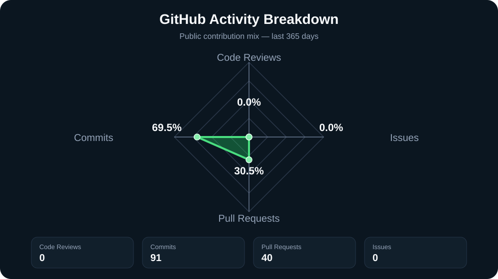
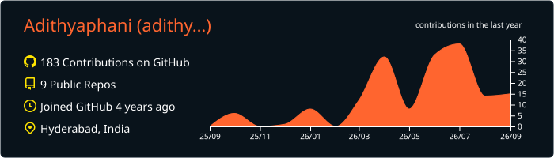
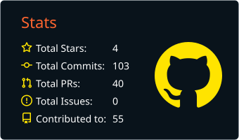
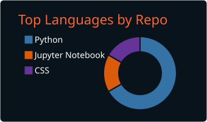
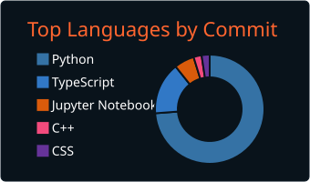
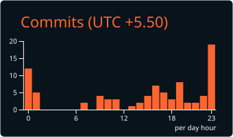

# Hi, I'm Adithya Phani Thota 👋

### AI • Quantum Computing • Applied Machine Learning • Intelligent Systems

I am an AI and Quantum Computing builder with an Electronics and Communication Engineering background. I focus on developing practical, research-driven systems involving artificial intelligence, quantum workflows, cloud-based backend services, automation, and intelligent decision-making.

My work combines software engineering, experimentation, simulation, and real-world problem solving.

---

## 🚀 Current Focus

- Quantum Drug-Discovery & Quantum Chemistry
- Quantum Reinforcement Learning for decision-making applications
- Quantum optimization and hybrid quantum-classical workflows
- AI-powered RAG systems and document intelligence pipelines
- FastAPI, Django, PostgreSQL, AWS, and cloud deployment
- Applied machine learning, automation, and intelligent agents
- Quantum Semiconductors and Quantum Error Correction Protocol.

---

## 🧠 Technical Areas

### Artificial Intelligence & Machine Learning
Python • Scikit-learn • PyTorch • TensorFlow • Reinforcement Learning • Generative AI • RAG • Vector Databases

### Quantum Computing
Qiskit • PennyLane • Cirq • Amazon Braket • Quantum Optimization • QAOA • Variational Algorithms • Quantum Machine Learning • Quantum Chemistry • Quantum Drug Discovery

### Backend & Cloud Engineering
FastAPI • Django • REST APIs • PostgreSQL • Amazon Web Services • Docker • GitHub Actions

### Embedded Systems & Research
MATLAB • Arduino • Sensor Systems • Data Visualization • Simulation • Technical Documentation

---

## 📌 Featured Projects

### Quantum Reinforcement Learning for Decision-Making
Exploring hybrid quantum-classical reinforcement learning methods for structured decision-making, optimization, and comparative benchmarking against classical reinforcement learning baselines.

### Deep-Space Trajectory Quantum Optimization
Developing a quantum-inspired optimization approach for trajectory planning, with a focus on improving selected mission parameters where classical optimization methods may become computationally expensive or limited.

### AI Hackathon Judge Project
An AI-powered hackathon judging system designed to assist in evaluating submissions and identifying top-performing projects based on defined scoring criteria.

### AI-Powered RAG and Backend Systems
Developing document-driven AI workflows that combine PDF ingestion, embeddings, vector retrieval, APIs, AWS-oriented cloud services, and retrieval-augmented generation.

### Smart AI Intelligent Ticket Routing System
An AI-based ticket routing system designed to classify incoming IT support tickets, assign them to the appropriate domain teams, and support automated resolution workflows.

### Head Movement Based Cursor Control
An assistive human-computer interaction system designed to translate head movement into cursor-control input using sensor data, Arduino-based hardware, and calibration logic.

### Ultrasonic Radar and Motion Visualization
An Arduino and MATLAB-based system for ultrasonic object detection, rotational scanning, and real-time polar visualization.

---

## 🛠️ Working Style

- Build practical prototypes with clear technical documentation
- Compare approaches using measurable baselines and experiments
- Use clean repository structures, branches, pull requests, and issues
- Focus on reproducible research and deployable software systems

---

## 📈 GitHub Contribution Activity

  Recent public GitHub activity across commits, pull requests, reviews, issues, and discussions.

---

## 🧭 GitHub Activity Mix

---

## 📊 GitHub Development Insights

 

<table align="center">
  <tr>
    <td align="center" width="50%">
      
    </td>
    <td align="center" width="50%">
      
    </td>
  </tr>
  <tr>
    <td align="center" width="50%">
      
    </td>
    <td align="center" width="50%">
      
    </td>
  </tr>
</table>

---

## 🤝 Open to Collaborate On

- AI and Quantum Computing research projects
- Quantum optimization and quantum machine learning
- Reinforcement learning and decision-making systems
- RAG, agentic AI, and cloud backend applications
- Open-source engineering and research-focused projects
- Freelance projects involving Quantum Computing, AI, backend systems, and intelligent automation

---

## 📫 Connect With Me

- LinkedIn: [Adithya Phani Thota](https://www.linkedin.com/in/adithya-phani-thota/)
- Portfolio: [Adithya Phani Portfolio](https://adithya-phani-sphere.lovable.app/)
- GitHub: [@Adithyaphani](https://github.com/Adithyaphani)

---

> Building at the intersection of AI, quantum computing, cloud engineering, and applied research.
